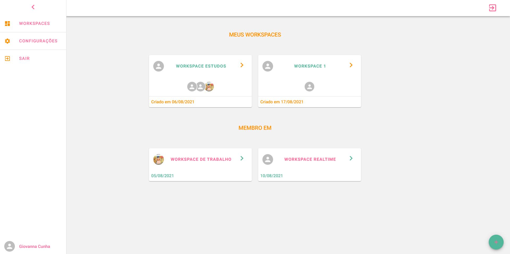

# 📃 Taskway Client

## See preview here: https://taskway-client.vercel.app/
## See API docs here: https://taskwayservice.herokuapp.com/

### Demo Credentials
- E-MAIL: 
- PASSWORD: 
---





<p align="center">
  <a href="#description">Description</a>&nbsp;&nbsp;&nbsp;|&nbsp;&nbsp;&nbsp;
  <a href="#Features">Features</a>&nbsp;&nbsp;&nbsp;|&nbsp;&nbsp;&nbsp;
  <a href="#how-to-use">How to Use</a>&nbsp;&nbsp;&nbsp;|&nbsp;&nbsp;&nbsp;
  <a href="#license">License</a>&nbsp;&nbsp;&nbsp;|&nbsp;&nbsp;&nbsp;
  <a href="#author-info">Author Info</a>
</p>

---

## Description
### Taskway is a web application to manage tasks in real time using workspaces.

## Technologies

### Front-end
- React
- NextJS
- Apollo Client
- Material UI

# Features

## PROGRESSIVE WEB APP
- This application has PWA functionalitites

## WORKSPACES

- Users can create workspaces.

- Users can add workspace members by email.

- Envited users can see workspace to which they were invited appear in real time.

- Only workspace owner can delete the workspace.

- Tasks creation and editon are shown in real time to all workspace members

## WORKSPACE MEMBERS

- Only workspace owner can add or remove new members

- When a workspace member is removed, all associated permissions are removed.

## PERMISSION

- Only workspace owners can assign permissions to workspace members, you can see the options below:

- Workspace owner has all permissions below

- Create Task

- Update Task

- Delete Task

## TASK

- Only users who have the create task permission, can create new tasks.

- Tasks have the following fields: 

- Title
- Description
- Link (Optional)
- File (Optional)
- Time (Optional)
- Assignment (Only workspace members)

## TASK COMMENTS (Subscriptions)

- It is possible to add comments to tasks

- They are shown in real time

## WORKSPACE CHAT (Subscriptions)
- Chat room can be created optionally by workspace owner

- All workspace members can participate

### REGISTRATION

### Users can register using email and password.

### ACCOUNT ACTIVATION
- When a user finish registration proccess, before login, the account must be activated. A short expiration token will be sent to the user's email.

### LOGIN

- It is possible to log in using e-mail and password, if account is not activated it will not be possible to login.

### FORGOT PASSWORD

- Users can recover access to the account by requesting a password change.
- A short expiration token will be sent to the user's email with a link to the password reset form.

### PROFILE

- Users can change their personal data and add a profile picture

---
## ❗ How To Use

### Run locally

### Clone the project

```html
git clone https://github.com/GiovannaK/taskway-client.git
```
### Assuming you already have NodeJS and npm installed and properly configured: Run the command below to install all required dependencies

```html
npm install
```
### Finally you can run the project
```html
npm run dev
```

---

## 📌 License

MIT License

Copyright (c) [2020]

Permission is hereby granted, free of charge, to any person obtaining a copy
of this software and associated documentation files (the "Software"), to deal
in the Software without restriction, including without limitation the rights
to use, copy, modify, merge, publish, distribute, sublicense, and/or sell
copies of the Software, and to permit persons to whom the Software is
furnished to do so, subject to the following conditions:

The above copyright notice and this permission notice shall be included in all
copies or substantial portions of the Software.

THE SOFTWARE IS PROVIDED "AS IS", WITHOUT WARRANTY OF ANY KIND, EXPRESS OR
IMPLIED, INCLUDING BUT NOT LIMITED TO THE WARRANTIES OF MERCHANTABILITY,
FITNESS FOR A PARTICULAR PURPOSE AND NONINFRINGEMENT. IN NO EVENT SHALL THE
AUTHORS OR COPYRIGHT HOLDERS BE LIABLE FOR ANY CLAIM, DAMAGES OR OTHER
LIABILITY, WHETHER IN AN ACTION OF CONTRACT, TORT OR OTHERWISE, ARISING FROM,
OUT OF OR IN CONNECTION WITH THE SOFTWARE OR THE USE OR OTHER DEALINGS IN THE
SOFTWARE.

---

## Author Info

- Linkedin - [Giovanna Cunha](https://www.linkedin.com/in/giovanna-cunha-4989b81b2/)
